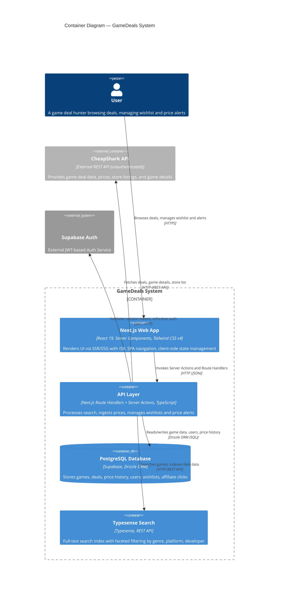

# C4 Container Diagram — GameDeals

## Level 2: Container Diagram

## Container Descriptions

### Next.js Web App (Container)
- **Tech**: Next.js 16 (App Router, Turbopack), React 19, Tailwind CSS v4, TanStack Query, Zustand
- **Responsibilities**: Renders UI with Server Components by default. Uses ISR (`revalidate=3600`) on the home page for fresh deal data without full rebuild. Client components handle search autocomplete, wishlist interactions, and modal overlays (intercepted routes). TanStack Query caches and auto-refetches server data. Zustand stores manage client-side state for auth, wishlist, and alerts.
- **Rationale**: Next.js 16 App Router provides hybrid SSR/SSG with streaming. Server Components minimize client bundle size. TanStack Query eliminates manual loading/error state management. Zustand replaces prop drilling for cross-component state (wishlist badge in Navbar updated from any page).

### API Layer (Container)
- **Tech**: Next.js Route Handlers (`src/app/api/cron/`), Server Actions (`src/actions/`), TypeScript
- **Responsibilities**: Acts as the backend gateway. Server Actions (`deals.ts`, `search.ts`, `alerts.ts`) handle deal fetching with validation, Typesense search with CheapShark fallback, and price alert processing. Route Handlers serve cron endpoints (`ingest-prices`, `reindex-typesense`, `check-alerts`) protected by `CRON_SECRET`.
- **Rationale**: Collocating API logic with the Next.js app eliminates a separate backend service. Server Actions enable direct database access from components without building REST endpoints. Cron routes run on Vercel's cron scheduler, keeping infra minimal.

### PostgreSQL Database (ContainerDb)
- **Tech**: Supabase PostgreSQL, Drizzle ORM
- **Responsibilities**: Persists all system state: `games`, `deals`, `price_history`, `users`, `wishlists`, `price_alerts`, `playlists`, `gamification`, `affiliate_clicks`. Drizzle schema uses snake_case columns matching Postgres convention.
- **Rationale**: Drizzle ORM provides type-safe SQL queries with zero runtime overhead (no query builder abstraction layer — generates raw SQL). The singleton `db` export pattern ensures a single connection pool across the app. Supabase adds auth and managed Postgres hosting.

### Typesense Search (Container)
- **Tech**: Typesense, InstantSearch Adapter
- **Responsibilities**: Powers fast full-text search with typo tolerance, faceted filtering (genre, platform, developer), and instant results. Admin client (server-side) indexes games; search-only client (client-safe) powers the search bar. Cron job re-indexes daily.
- **Rationale**: Typesense provides sub-50ms search latency vs CheapShark's multi-second API responses. Faceted filtering enables drill-down by genre/platform. Fallback to CheapShark search when Typesense is unconfigured ensures resilience.

### CheapShark API (Container_Ext — External)
- **Tech**: CheapShark REST API v1.0 (unauthenticated)
- **Responsibilities**: The sole data source for game deals, prices, store information, and game details. API client in `src/services/api.ts` wraps endpoints (`/deals`, `/games`, `/stores`) with Next.js `revalidate` cache options.
- **Rationale**: No API key required — free and unauthenticated. ISR caching (`revalidate=3600`) reduces redundant requests. Fallback data (`src/data/fallbackDeals.ts`) ensures the site renders when CheapShark is unavailable.

### Supabase Auth (System_Ext — External)
- **Tech**: Supabase Auth (JWT-based, PKCE flow)
- **Responsibilities**: Handles user authentication — sign-up, sign-in, session refresh, cookie management. Middleware (`src/middleware.ts`) refreshes session on every request and protects `/wishlist`, `/alerts`, `/playlists`, `/profile` routes. Server client validates JWT for Server Actions. Browser client handles `onAuthStateChange` subscription.
- **Rationale**: Fully managed auth eliminates custom session logic. SSR integration via `@supabase/ssr` provides seamless cookie-based sessions. The lazy-init pattern in `authStore.ts` avoids evaluating `createClient()` at module scope.
