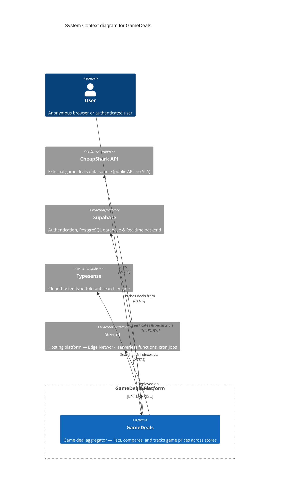

# C4 Level 1 — System Context Diagram

> **Scope**: GameDeals platform — system context.
> **Primary elements**: The GameDeals software system itself, external actors (people and systems).
> **Intended audience**: Technical and non-technical stakeholders — developers, architects, product managers, new team members.

## Diagram

## Actor Descriptions

### Person — User

Users browse the application anonymously or create an authenticated account via Supabase Auth (email/password or social login). Anonymous users can view deals, search, and browse bundles. Authenticated users additionally manage wishlists, set price alerts, earn XP and badges, and create playlists.

**Trust boundary**: Public — all client-server communication occurs over HTTPS. Sessions are managed via Supabase SSR cookies.

### System — GameDeals

The central system — a Next.js 16 (App Router) SSR application styled with Tailwind CSS v4. Server Components render most pages by default, with client-side interactivity via TanStack Query, Zustand, and React Server Actions. Data flows between the external systems listed below.

### System_Ext — CheapShark API

Primary data source for game deals. Provides endpoints for listing deals (`/deals`), fetching game details (`/games`), and listing stores (`/stores`). The API is public and requires no authentication. Reliability is outside our control — the application implements fallback data (`@/data/fallbackDeals`) and defensive error handling in `src/services/api.ts`.

**Trust boundary**: No auth — public HTTP calls. A `next.revalidate` cache window of 3600s absorbs transient failures.

### System_Ext — Supabase

Managed backend providing three core services:
- **Authentication**: Supabase SSR (`@supabase/ssr`) with cookie-based session management via `src/utils/supabase/server.ts` (server) and `src/utils/supabase/browser.ts` (client).
- **Database**: PostgreSQL accessed through Drizzle ORM — stores games, deals, price history, wishlists, user profiles, playlists, and gamification data.
- **Realtime**: Subscription support for live wishlist updates.

**Trust boundary**: Confidential — server-side calls use the anon key (RLS-enforced) or service role key (admin operations). Database credentials (`DATABASE_URL`) are never exposed to the client bundle.

### System_Ext — Typesense

Cloud-hosted search engine providing typo-tolerant, faceted full-text search across the game catalog. The admin client (`src/lib/typesense.ts`) runs server-side for indexing; the search-only client is safe for browser-side InstantSearch queries. A daily cron (`api/cron/reindex-typesense`) reindexes updated game records.

**Trust boundary**: Internal — admin API key (`TYPESENSE_ADMIN_KEY`) is server-only. The search-only key (`NEXT_PUBLIC_TYPESENSE_SEARCH_KEY`) is safe for client-side use.

### System_Ext — Vercel

Hosting and deployment platform. Next.js 16 is deployed to Vercel's Edge Network with serverless functions, ISR, and cron job support. The deployment pipeline is triggered by pushes to the `main` branch. Vercel Cron Jobs drive the three data-pipeline endpoints (`ingest-prices`, `reindex-typesense`, `check-alerts`) authenticated via a shared `CRON_SECRET`.

**Trust boundary**: Platform-level — all communication via HTTPS. Environment variables (secrets) are managed through Vercel's encrypted environment store.

## Trust Boundary Summary

| Interaction | Protocol | Credentials | Risk Level |
|---|---|---|---|
| Browser ↔ GameDeals | HTTPS | Session cookies | Low |
| GameDeals ↔ CheapShark | HTTPS | None (public API) | Low (fallback data exists) |
| GameDeals ↔ Supabase (auth) | HTTPS/JWT | Supabase anon key | Low |
| GameDeals ↔ Supabase (admin) | HTTPS | Service role key | High — server-only |
| GameDeals ↔ Typesense (admin) | HTTPS | Admin API key | High — server-only |
| GameDeals ↔ Typesense (search) | HTTPS | Search-only key | Low |
| GameDeals ↔ Vercel | HTTPS | Encrypted env vars | Low |

## Related Documents

- [ADR-001: Tech Stack](../adr/ADR-001-tech-stack.md)
- [ADR-004: Auth & Backend](../adr/ADR-004-auth-backend.md)
- [ADR-010: Search Architecture](../adr/ADR-010-search-architecture.md)
- [C4 Level 2 — Container Diagram](c4-container.md)
