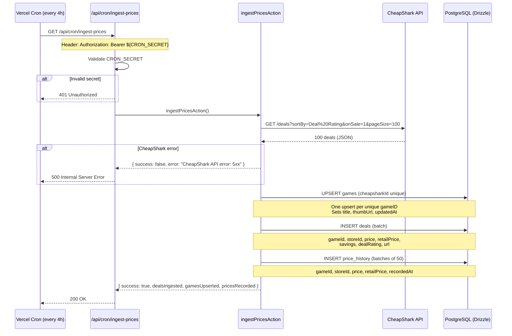
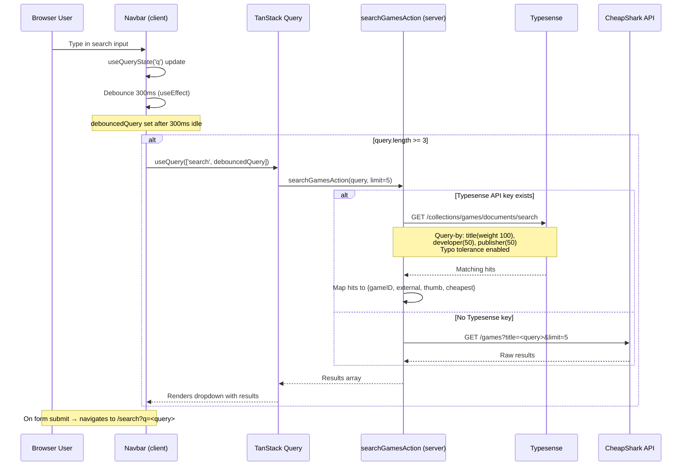
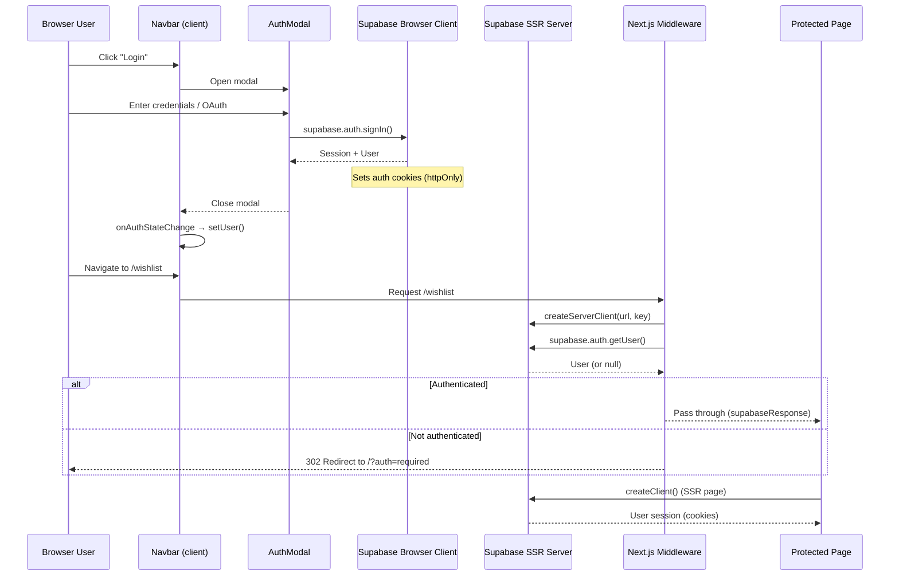
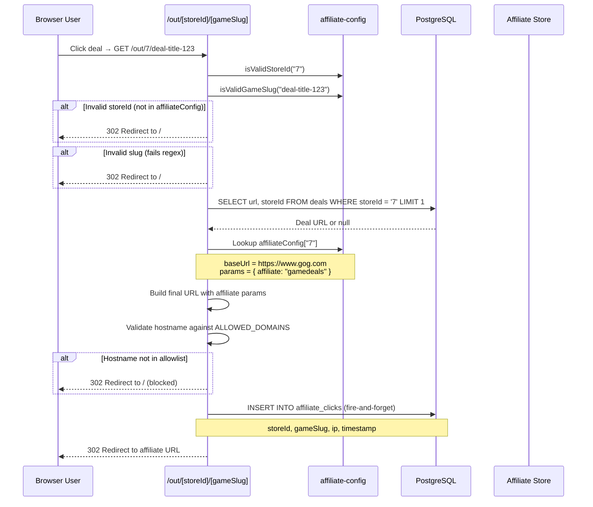
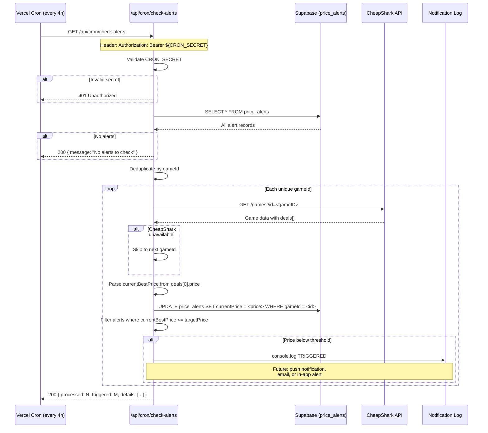

# Data Flow Architecture

This document describes the five primary data flows in the GameDeals system.
Each flow includes a Mermaid sequence diagram, trigger description, failure
modes, and code locations.

---

## Flow 1: Price Ingestion

Fetches the latest game deals from CheapShark, upserts game records, inserts
deal entries, and records price snapshots for historical tracking.

### Sequence

### Trigger

Vercel Cron Job — runs every 4 hours. Configured via `vercel.json` or
Vercel dashboard.

### Failure Modes

| Mode | Symptom | Handling |
|------|---------|----------|
| CRON_SECRET mismatch | Request returns 401 | Cron job retries on next tick |
| CheapShark API down | HTTP 5xx response | Action returns error, no DB writes |
| CheapShark returns empty | `deals.length === 0` | Returns success with zero counts |
| DB connection failure | Drizzle throws | Caught by try/catch, returns error |

### Code Locations

| File | Role |
|------|------|
| `src/app/api/cron/ingest-prices/route.ts` | Cron endpoint, auth check |
| `src/actions/deals.ts` (lines 108-215) | `ingestPricesAction` — fetch + upsert + insert |
| `src/db/schema/games.ts` | Games table schema |
| `src/db/schema/deals.ts` | Deals table schema |
| `src/db/schema/price_history.ts` | Price history table schema |
| `src/services/api.ts` | Client-side CheapShark wrapper (separate from cron) |

---

## Flow 2: Search

Provides live search-as-you-type results via Typesense with automatic
fallback to CheapShark direct API when Typesense is unavailable.

### Sequence

### Trigger

User input in the Navbar search field. Debounced at 300ms. Minimum query
length of 3 characters. Also triggers on form submission which navigates
to the full `/search` results page.

### Failure Modes

| Mode | Symptom | Handling |
|------|---------|----------|
| Typesense unreachable | `typesenseSearch` throws | Caught in try/catch, returns empty array |
| No Typesense configured | Both key env vars empty | Falls back to CheapShark `/games` endpoint |
| CheapShark also fails | HTTP error or exception | Returns empty array |
| Network timeout | fetch rejects | Caught, empty results shown |

### Code Locations

| File | Role |
|------|------|
| `src/components/Navbar.tsx` (lines 17-40) | Debounce + TanStack Query + dropdown rendering |
| `src/actions/search.ts` (lines 18-43) | `searchGamesAction` — Typesense/CheapShark dispatch |
| `src/lib/typesense.ts` (lines 87-115) | `searchGames` — Typesense HTTP search call |
| `src/app/search/page.tsx` | Full search results page (form target) |

---

## Flow 3: Authentication

Handles user login, session management, and route protection via Supabase
SSR with middleware-enforced access control.

### Sequence

### Trigger

- **Login flow**: User clicks Login button in Navbar → AuthModal opens
- **Route protection**: Any navigation to `/wishlist`, `/alerts`, `/playlists`,
  or `/profile`

### Failure Modes

| Mode | Symptom | Handling |
|------|---------|----------|
| Supabase env vars missing | `createServerClient` throws | 500 at middleware level |
| Session expired | `getUser()` returns null | Redirect to home with `?auth=required` |
| Cookie parse error | SSR client cannot read cookies | `updateSession` creates new response |
| Auth API down | `getUser()` throws | Propagates as middleware error |

### Code Locations

| File | Role |
|------|------|
| `src/middleware.ts` | Entry point, delegates to `updateSession` |
| `src/utils/supabase/middleware.ts` | `updateSession` — create SSR client, refresh session, protect routes |
| `src/utils/supabase/server.ts` | `createClient` — SSR pages that need session |
| `src/utils/supabase/client.ts` | `createClient` — browser-side Supabase client |
| `src/store/authStore.ts` | Zustand store — lazy-init browser client, listen to auth changes |
| `src/components/Navbar.tsx` (lines 42-81) | Hydrate from SSR, subscribe to auth state |
| `src/components/AuthModal.tsx` | Login UI (email/OAuth) |

---

## Flow 4: Affiliate Redirect

Cloaks outbound affiliate links through a validated redirect pipeline.
Validates store and slug, builds the affiliate URL, logs the click, then
redirects.

### Sequence

### Trigger

User clicks a deal card or deal link on any page. The link points to
`/out/[storeId]/[gameSlug]` with a validated slug.

### Failure Modes

| Mode | Symptom | Handling |
|------|---------|----------|
| Invalid storeId | `isValidStoreId` returns false | Redirect to `/` (safe fallback) |
| Invalid slug format | `isValidGameSlug` returns false | Redirect to `/` |
| Deal URL not in DB | `deal?.url` is null | Falls back to `config.baseUrl` |
| DB query throws | `db.execute` catches | Logs error, uses baseUrl |
| Hostname not allowed | `ALLOWED_DOMAINS.has()` false | Redirect to `/`, logs warning |
| Affiliate click insert fails | `.catch(() => {})` | Silent — fire-and-forget pattern |

### Code Locations

| File | Role |
|------|------|
| `src/app/out/[storeId]/[gameSlug]/route.ts` | Redirect handler — validation, URL building, logging |
| `src/lib/affiliate-config.ts` | `affiliateConfig` map, `ALLOWED_DOMAINS`, validators |
| `src/db/schema/affiliates.ts` | `affiliate_clicks` and `affiliate_links` schemas |

---

## Flow 5: Price Alert Check

Periodically checks all active price alerts against current CheapShark
prices, records the latest price, and triggers notifications when the
target threshold is met.

### Sequence

### Trigger

Vercel Cron Job — runs every 4 hours.

### Failure Modes

| Mode | Symptom | Handling |
|------|---------|----------|
| CRON_SECRET mismatch | 401 | Cron retries next tick |
| price_alerts table empty | Empty result set | Returns 200 with "No alerts" message |
| CheapShark API error (per game) | `res.ok` false | `continue` — skip that game, process others |
| Game has no deals | `deals.length === 0` | `continue` — skip |
| DB update fails | `updateError` non-null | Logs error, alert processed with old price |

### Code Locations

| File | Role |
|------|------|
| `src/app/api/cron/check-alerts/route.ts` | Full alert check logic |
| `src/db/schema/price_history.ts` (lines 30-47) | `priceAlerts` table schema |

---

## Diagram Summary

| Flow | Diagram Type | Primary External Dependency |
|------|-------------|----------------------------|
| 1. Price Ingestion | Sequence | CheapShark API |
| 2. Search | Sequence | Typesense / CheapShark API |
| 3. Auth | Sequence | Supabase Auth |
| 4. Affiliate Redirect | Sequence | Affiliate store domains |
| 5. Alert Check | Sequence | CheapShark API |

All diagrams use [Mermaid](https://mermaid.js.org/) `sequenceDiagram` syntax
and render natively in GitHub-flavored markdown.
